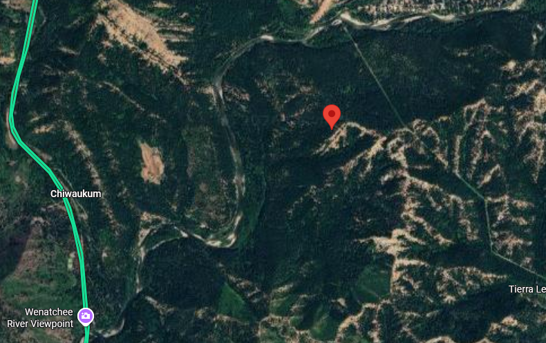
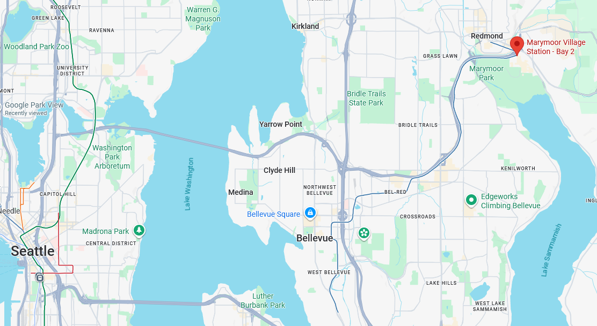

# CTF League - EvilCorpVacay


## Flag 1
For the first flag, we had to discover the location this photo was taken, and submit the cameramans latitude and longitude. Most smartphone cameras record the GPS location with photos by default, so we checked the exifdata of the photo to see if this was the case for this image:

```bash
GPS Latitude                    : 47 deg 41' 49.09" N
GPS Longitude                   : 120 deg 41' 49.09" W
GPS Position                    : 47 deg 41' 49.09" N, 120 deg 41' 49.09" W
```
Unfortunately, this data had been modified, as it's actual location was in the middle of the Okanogan-Wenatchee National Forest.



Looking at the contents of the photo, we can see one road sign that reads "Redmond, City Center, Sammamish, Fall City", There also appears to be either powerlines or trainlines off to the side of the freeway, and with the large parking structure in frame, it would make sense to be trainlines for a park-and-ride system. 

After some time looking through the Redmond and Sammamish area for train stations near freeways that looked similar to the photo, we eventually identified it as the Marymoor Village Station, we now just needed to find its precise coordinates, which we pinpointed by where the freeways barrier switches from cement to metal, which was found as `47.66 N 122.11 W` and submitted for the flag.

## Flag 2

The prompt for the second flag was:
> What is the last completed milestone for the extension that will connect this train to the nearby metropolitan center?

Knowing that this was the Marymoor Village Station, we assumed the nearby metropolitan area would be Seattle, and as this is a transit project, it's completion details should be tracked  WSDOT or a local government agency. Looking at Google Maps Transit information for the Seattle area:



To connect to Seattle, from where the blue line already exists, it would only make sense to use the existing Mercer Island Bridge, so we looked for Mercer Island Train Construction projects and found the [Sound Transit Page](https://www.soundtransit.org/system-expansion/mercer-island-station). Browsing through this page, we eventually found the [East Link Extension](https://www.soundtransit.org/system-expansion/east-link-extension) page, which seemed promising as the prompt specifically desribed it as an "extension". That page links to a section called [Timelines and Milestones](https://www.soundtransit.org/system-expansion/east-link-extension/timeline-milestones). 

The last milestone that the page marks as complete is `Undercrossing on 112th Avenue Southeast in Bellevue gets started`, which we submitted for the flag.

## Bonus Flag
This challenge only advertised the above 2 flags, but when we first checked exifdata, there was an additional flag in the `Make` metadata field.
```bash
$ exiftool EvilCorpVacay.jpg
ExifTool Version Number         : 12.76
File Name                       : EvilCorpVacay.jpg
File Size                       : 392 kB
File Modification Date/Time     : 2026:02:08 14:59:55-08:00
File Access Date/Time           : 2026:02:11 18:29:21-08:00
File Inode Change Date/Time     : 2026:02:09 18:20:19-08:00
File Permissions                : -rw-r--r--
Exif Byte Order                 : Big-endian (Motorola, MM)
Make                            : osu{5mart_t0_ch3ck_3x1f}
```