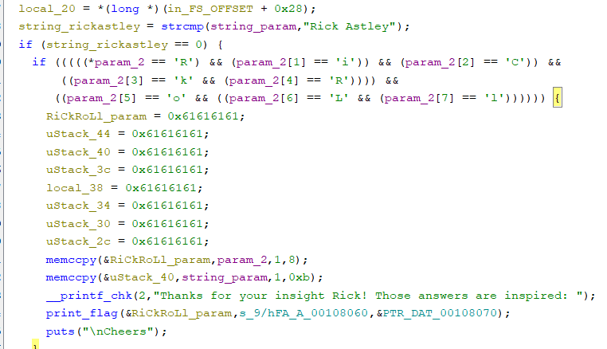
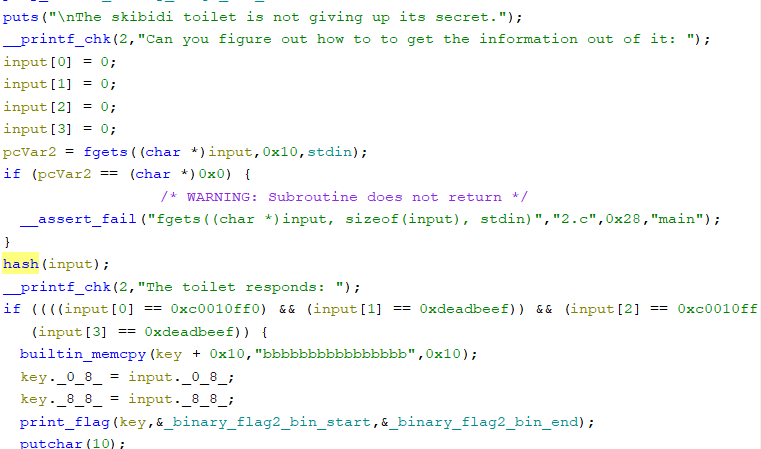
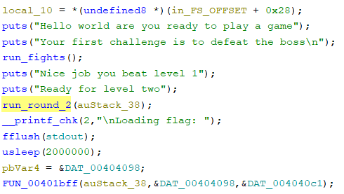

# CTF League - Adventure

## Flag 1
The first program provided a user input field for `name`, then began a long chain of choose your own adventure style questions. Inspecting the program in ghidra, after the choose your own adventure chain ended, it would verify that the name input was "Rick Astley" and the array of choose your own adventure responses where "RiCkRoLl"
 

The name input was easy enough, but the choose your own adventures were more involved. We can see during the SAT Math questions, the answer would be written to the buffer that would later be checked to equal "RiCkRoLl". 


To get that check to pass, we had to trigger each SAT question, answer it with the respective character of "RiCkRoLl", then choose the next SAT question, eventually choosing 0 to end. Our input are described in the table below:

| SAT Question | Choose Your Own Adventure Number | Answer |
|-|-|-|
| Q1 | 111| R |
| Q2 | -1| i |
| Q3 | 98| C |
| Q4 | -86| k |
| Q5 | -44| R |
| Q6 | 4| o |
| Q7 | =123| L |
| Q8 | 77| l |

## Flag 2
Dissasembling the second binary, we are provided with 1 input field, which would then be hashed. If our input computed the expected hash, the flag would be printed.


If we wanted we could attempt to reverse engineer the hash function, but that was unnecessary for this challenge. Because we have the binaries locally and this one contained debug symbols, it is simple to run the program with gdb, and manually modify the memory right before the `if(input[0]==....)` check. Our strategy for this was to set a breakpoint at the call to `hash`, step over that call, and run the following to set the memory contents.
```sh
set var input[0] = 0xc0010ff0
set var input[2] = 0xc0010ff0
set var input[1] = 0xdeadbeef
set var input[3] = 0xdeadbeef
```

Continuing execution, regardless of our initial input we now pass the hash check and flag 2 is printed to the terminal.
## Flag 3
The final program was of a simple game. The first round would have you input a "fighter" as a hex string, and then send your fighter into battle. The second round was a series a math problems.



We first tried to build a fighter that could beat round 1, unfortunately, reverser engineering the fight logic, it was mathematically impossible to beat. Worse still, the `lose()` function would call `exit()`, which killed the program. This meant we needed someway to modify the program in memory to not call the round 1 function. 

```
────────────────────────────────────────────────────────────────[ DISASM / x86-64 / set emulate on ]─────────────────────────────────────────────────────────────────
   0x55555555598c <main+23>    xor    eax, eax               EAX => 0
   0x55555555598e <main+25>    lea    rdi, [rip + 0x903]     RDI => 0x555555556298 ◂— 'Hello world are you ready to play a game'
   0x555555555995 <main+32>    call   puts@plt                    <puts@plt>
 
   0x55555555599a <main+37>    lea    rdi, [rip + 0x927]     RDI => 0x5555555562c8 ◂— 'Your first challenge is to defeat the boss\n'
   0x5555555559a1 <main+44>    call   puts@plt                    <puts@plt>
 
 ► 0x5555555559a6 <main+49>    mov    eax, 0                 EAX => 0
   0x5555555559ab <main+54>    call   0x5555555552fb              <0x5555555552fb>
 
   0x5555555559b0 <main+59>    lea    rdi, [rip + 0x755]     RDI => 0x55555555610c ◂— 'Nice job you beat level 1'
   0x5555555559b7 <main+66>    call   puts@plt                    <puts@plt>
 
   0x5555555559bc <main+71>    lea    rdi, [rip + 0x763]     RDI => 0x555555556126 ◂— 'Ready for level two'
   0x5555555559c3 <main+78>    call   puts@plt                    <puts@plt>
```

Running the program in GDB, we can see the line we want to skip, at address `0x5555555559ab`. In this case, since there are no side effects of the function (e.g dealing with return values, arguments, etc. ). We can simply make the Program counter skip the `call` instruction that calls our undesired function. The program counter is simply a register that contains the address of the instruction to execute, which in x86 is the RIP register. GDB provides a utility to modify register contents, which we can do as below. Critically to prevent any unintentional breaking changes, we want to skip as little as we can, our method was to set a breakpoint right before the `call `, then modify the PC as below to the instruction that round1 would return to. 
```
set $rip = 0x5555555559b0
```
After skipping this we can continue the program normally, correctly answering the math problems in round 2, which printed the flag. 