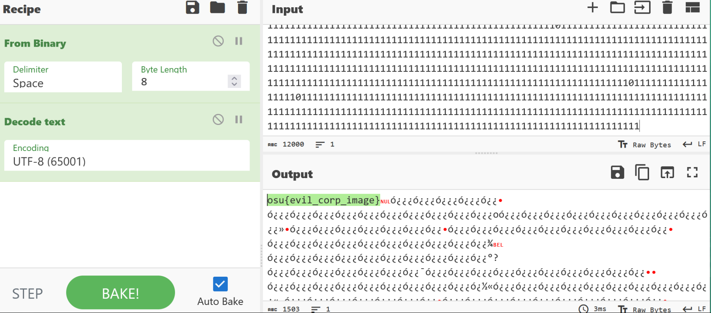

# Anonymous Images

## Flag 1
The first flag was hidden in a custom tag in the metadata of an image. We found this running exiftool on the file.
```sh
$ exiftool flag1.png
ExifTool Version Number         : 12.76
File Name                       : flag1.png
Bit Depth                       : 8
Color Type                      : RGB with Alpha
Compression                     : Deflate/Inflate
Evil Corp                       : osu{flag1}
Image Size                      : 1024x819
```

## Flag 2
From the pre-challenge talk, we were told that flag2 is hidden via Least Significant Bit encoding in the blue pixel. Within the RGB values for each pixel, the least significant bit for each pixel changes the image such an amount that is unnoticeable to the human eye, but can be used to encode data (as used in this chal).

We wrote a python script using Pillow to read the RGB bits for each pixel in the image, and append the least significant bit of B to a string. Using cyberchef, we turned that bitstring into ASCII which revealed the flag.

### Script
```py
from PIL import Image

img = Image.open("flag2.png")

px = img.load()

width, height = img.size

binString = ""

for y in range(10):
    for x in range(width):
        _, _, b = img.getpixel((x,y))
        binValue = b % 2 
        binString = binString + str(binValue)

print(binString)
```
