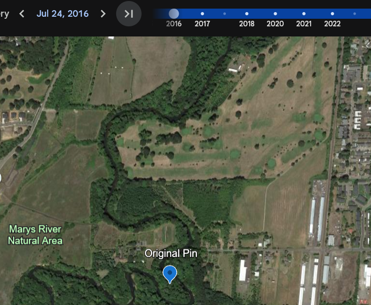
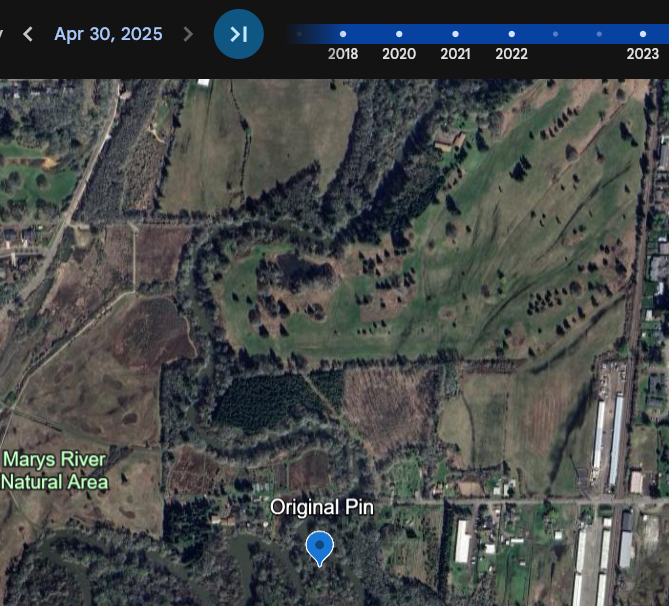

# CTF League - casual-water

## Flag 1

For this OSINT challenge, we were first given a map with a pin, and asked to find the latitude/longitude of the location. A reverse image search 
suggested the Marys River, which made sense as it is nearby to Corvallis. Following the Mary's River from it's confluence with the Wilamette River, we were able to find the location in question [here](https://maps.app.goo.gl/mRwMhM14n7VRZWh39), solving the first flag.

## Flag 2

For the second flag, we were provided a partially torn note between the characters of this themed challenge that suggests they are using a location nearby the first pin as a hideout, we needed to find the name of this location. The most useful part of this note was the "closed since 2017". Because the neighboring area of the first pin is mostly forest, or suburban neighborhood, there isn't much use in historical street view data, but looking at historical Google Earth satellite imagery was more useful. 

Comparing the 2016-2025 image differences, to the northeast of the original pin the grass appeared to have been manicured like a Golf Course, which appears on Google Maps as the now closed Marysville Golf Course, and grants the second flag.

## Flag 3
The final flag asked us to find the 3 words told to the "Mode" character that convinced them to purchase the Golf Course. While the Golf course is now closed, their website was archived many times and available on the [internet archive](https://web.archive.org/web/20161227074015/http://marysvillegolf.net/4101.html). Most interestingly the history tab of the site details how the golf course came to be, including that Mode decided to purchase the land after his wife told him "I want it", which proved to be the final flag.