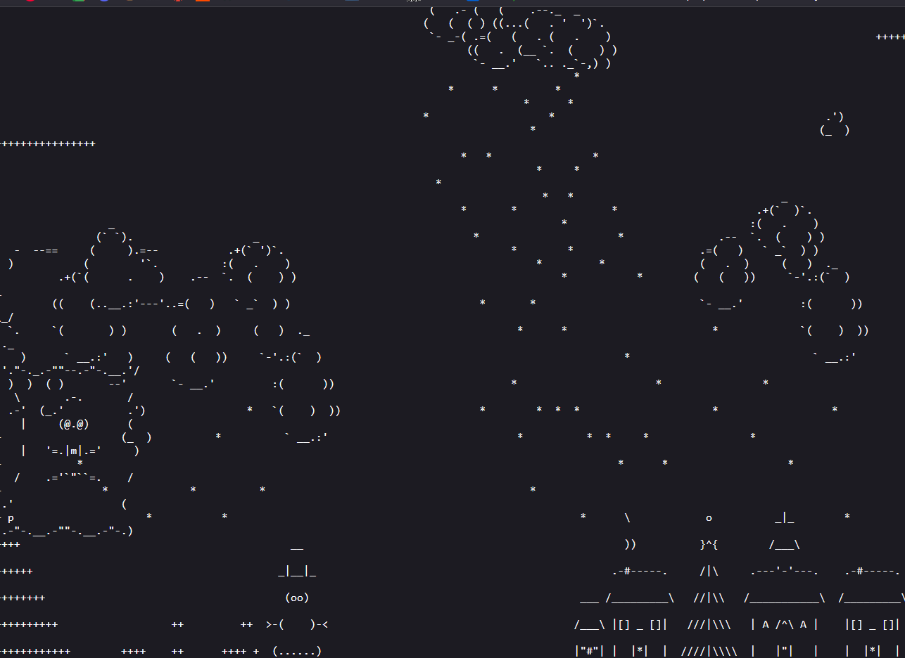
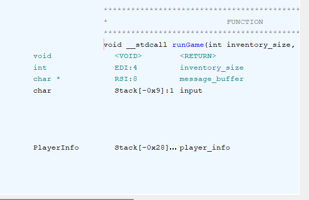

# CTF League - sm-winter

## Flag 1

In this challenge, we are given a c source file for a platformer game, 

We can see the first flag will be printed when we maneuver our character onto a space in the level containing a 1, unfortunately, the only `1` in the level is behind an impassable wall.

```c
char *handleMovement(unsigned char *xpos, unsigned char *ypos, char level[LEVELHEIGHT][LEVELWIDTH], int input) {
    if (level[*ypos+1][*xpos] != ' ') {
        jumpCount = 0;
    }
    if (input == 'd')
        (*xpos) ++;
    ...
    }
    if (input == 's')
        (*ypos) ++;
    switch (level[*ypos][*xpos]) {
        case ' ':
            break;
        case 'f':
            return "Does this feel like the end?\n";
            break;
        case '1':
            read_flag();
            break;
        default:
            if (input == 'w')
                (*ypos)++;
            else if (input == 'a')
                (*xpos)++;
            ...
}
```

Inspecting the `main` function we can find that the players x and y position are stored in `unsigned char`s. A `char represents 1 byte, and can hold typically hold values from (-126, 126), but unsigned allows values between (0,255). If we can underflow our x position to -1, the standard behavior of `unsigned char` will be to wrap around to the maximum value of 255, teleporting our character to the other side of impassable wall.

Looking more closely at the `handleMovement()` function, we can see it performs no bounds checking, and simply increments or decrements the respective position value on `wasd` input.



Looking at the map, we can climb up the stars to the clouds, then glide down to the left side and go out of bounds, underflowing our x position and wrapping around to the `1` to get the flag

## Flag 2
Level 2 is mostly similar to level 1, with the addition of an inventory. Additionally, to reach the `1` key, we need to pass the `paid_unlock()` function by having exactly 1650549605 dollars to our characters name. There are several `$` items scattered throughout the level, but each only gives $1, so we'll need another way.

```c
char* paid_unlock(char key, struct PlayerInfo *player_info) {
    if (blocks[key].solid == 1) {
        if (player_info->dollars == 1650549605) {
            player_info->dollars = 0;
            blocks[key].solid = 0;
            return "Unlocked!";
        }
        else if (player_info->dollars > 1650549605) {
            return "Your excessive wealth disgusts me.";
        }
        else {
            return "Sorry! You need $1650549605 to unlock me!";
        }
    }
    return "";
};
```

Looking at the `Player` struct our inventor is located directly next to the dollars, which should be opportune for buffer overflows.

```c
struct PlayerInfo {
    int jumpCount;
    int collected_items;
    unsigned char xpos;
    unsigned char ypos;
    char inventory[4];
    uint dollars;
};
```

Looking at how the program handles interactions with things we can put in our inventory, there are no checks that we still have room in our inventory before storing the collectable there. This means the buffer overflow strategy is on, after filling up our standard inventory (and some padding), every future collectable we acquire modifies the `dollars` value.

```c
if (current_block_properties.collectable) {
    player_info->inventory[player_info->collected_items] = current_level_location;
    player_info->collected_items ++;
}
```

Since our target is `1650549605` and we are on a little endian system, we want `e c a b` to be stored in our dollars value, but unfortunately there is no `e` collectable. This is no issue, however, because there is a `d` collectable, whose ascii value is 1 less than `e`, and that remaining dollar can be acquired via the `$` collectable.

By filling out our players inventory, then oveflowing with `dcab$`, we can now pass through the `paid_unlock()` function, and get the second flag.

## Flag 3
For flag3 there were no additional materials provided, but inspecting the level2 binary in ghidra, we can see there is an additional function that is never used called `another_flag` at address `0x63626161`. That is immediately a very nice address as it is ascii `cbaa`, or for our little endian system `aabc`. If we can overflow our inventory through the whole stack up to the return address, we can make the program return into the `another_flag` function instead of the standard cleanup from `main`. 




Looking at the structure of the stack in Ghidra, we can see that our playerInfo struct exists 0x28 or 40dec below the stack base. Since it is a 20 byte object, and the next stack variable is at 0x9, there are 11 bytes of padding in between them. With 2 bytes of padding and the 4 byte dollar field after the inventory, then 11 bytes of padding and a 1 byte input variable, then 8 bytes for stored `RBP`, there are 26 total bytes between the end of our inventory and the return address. 

This means with a similar overflow attack to flag 2, we can fill up the inventory, then 26 arbitrary bytes of data, then write `aabc` into the return address, causing the program to jump to `another_flag()` after quitting instead of back to `main`, which gives the third flag. 